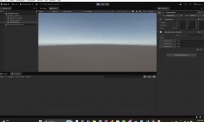
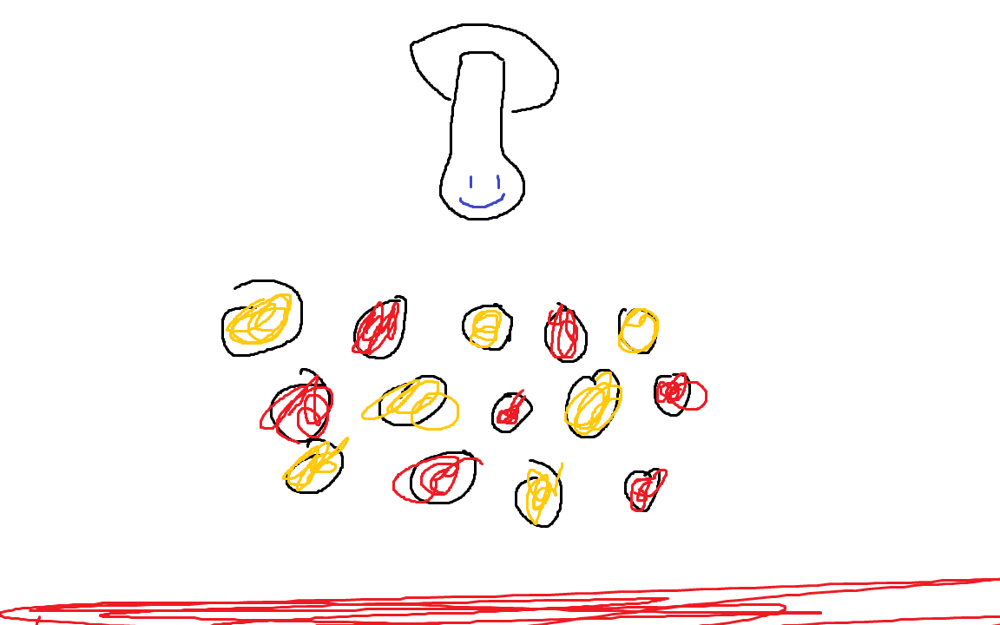

# M2_gdv

# opdracht 1: array
# beschrijving: op enter klikken om een willekeurig item uit de lijst te doen, op escape klikken om alle items te noemen

hier is de link naar mijnnn code [link](array/RandomItem.cs)

# PEGGLE

# beschrijving: het is hetzelfde als het peggle voorbeeld die op het bord werd laten zien maar dan in 3d.

# opdract 3.2:

# code:
[Peggle.cs](peggle/game%20development%20opdracht%202/Assets/Peggle.cs)
[bumperhit.cs](peggle/game%20development%20opdracht%202/Assets/scripts/bumperhit.cs)
[launcher.cs](peggle/game%20development%20opdracht%202/Assets/scripts/launcher.cs)
[ScoreManager.cs](peggle/game%20development%20opdracht%202/Assets/scripts/ScoreManager.cs)